# 🎉 EventSphere – Event & Movie Booking Platform (Frontend)

EventSphere is a modern, responsive **frontend-only** platform built using React. It allows users to browse and book **events and movies**, offering a complete booking flow through a well-structured UI. Users can explore events, check movie listings, select dates, pick cinemas, choose show timings, select seats, choose ticket quantities, and proceed to a styled checkout interface.

This project focuses fully on **UI/UX**, component structure, and navigation — without backend or database connectivity.

---

## 🚀 Tech Stack Used

The frontend is built with:

**Frontend Technologies:**
React.js, React Router, JavaScript (ES6+), CSS / TailwindCSS / Styled Components (depending on your setup)

**Development Tools:**
Vite or Create React App, Node.js, Git & GitHub, VS Code

---

## ⚙️ Setup Steps (Run Locally)

### Step 1 — Clone the Repository

```bash
git clone https://github.com/AyushGupta915/EventSphere
cd EventSphere
```

### Step 2 — Install Dependencies

```bash
npm install
```

### Step 3 — Start Development Server

If using **Vite**:

```bash
npm run dev
```

Runs on:
**[http://localhost:5173](http://localhost:5173)**

If using **CRA**:

```bash
npm start
```

Runs on:
**[http://localhost:3000](http://localhost:3000)**

---

## 🎨 Features (UI Only)

EventSphere provides **two main booking flows** — Event Booking & Movie Booking.

---

## 🎭 Event Booking Features

The event section gives users a smooth ticket booking experience with:

* Event discovery homepage showcasing upcoming and trending events
* Event cards with images, categories, and timing
* Detailed event page with description and highlights
* Option to **select number of tickets**
* Dynamic ticket price calculation based on quantity
* Proceed to **checkout UI** showing:

  * Event name
  * Selected number of tickets
  * Total cost
  * Next-step or confirm button

This simulates real event booking UX entirely on the frontend.

---

## 🎬 Movie Booking Features

The movie booking flow includes a complete UI-based theatre experience:

* Browse latest and trending movies
* Movie details page with storyline, poster, cast, and ratings
* **Date selection** with a calendar-style UI
* **Cinema selection** from multiple theatres
* **Showtime selection** (morning, afternoon, evening, night)
* **Seat selection grid**:

  * Available seats
  * Selected seats
  * Booked seats (blocked visually)
* Dynamic seat count and total amount calculation
* **Checkout UI** summarizing:

  * Movie name
  * Cinema
  * Date
  * Showtime
  * Selected seats
  * Total amount

This flow replicates a real movie ticket booking interface.

---

## 🗂️ Project Structure

```
EventSphere/
 ├── public/
 ├── src/
 │    ├── components/       # Reusable UI components
 │    ├── pages/            # Event & Movie pages
 │    ├── assets/           # Images/icons
 │    ├── App.jsx
 │    └── main.jsx
 ├── package.json
 └── README.md
```

---

## 📸 Screenshots

<p align="center">
  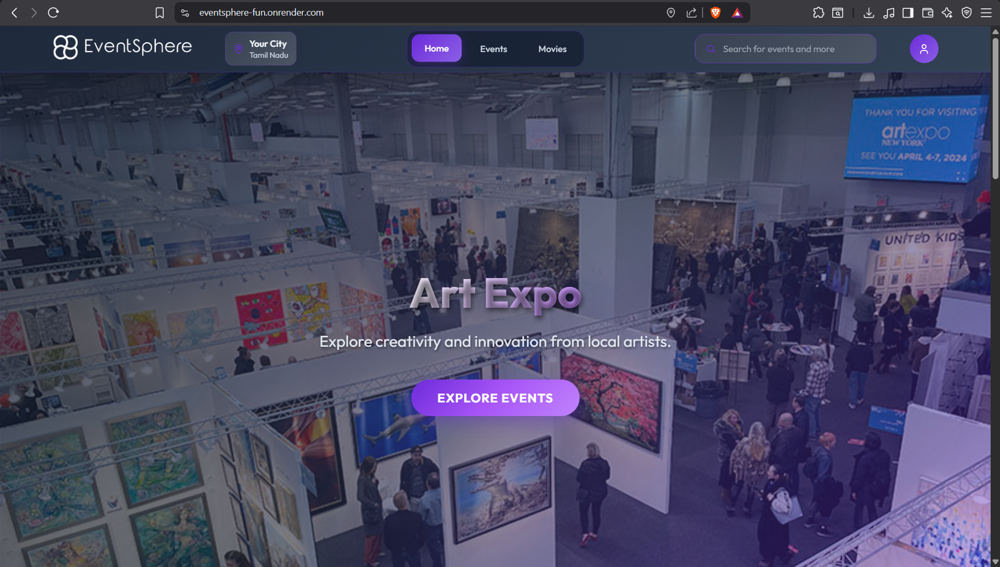
  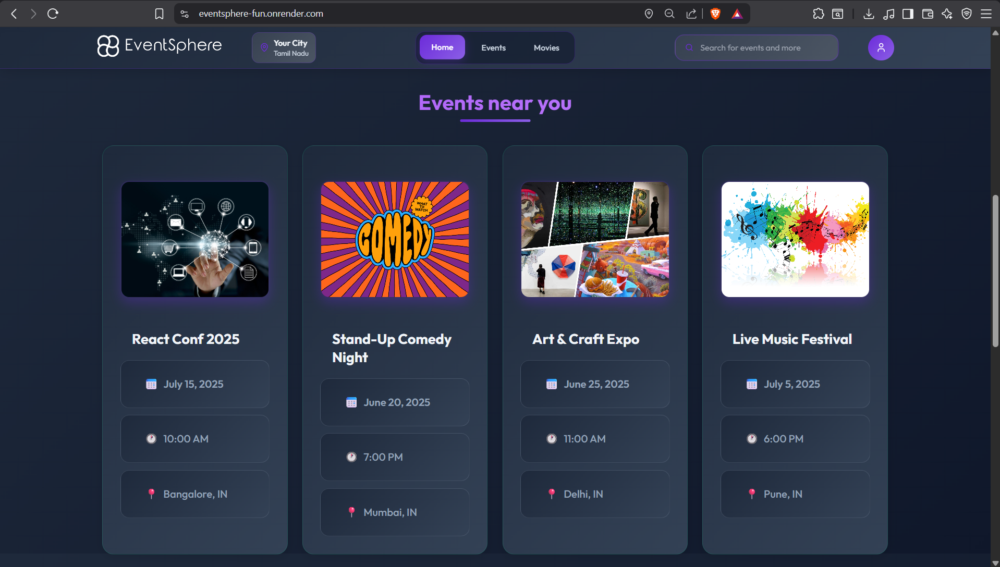
</p>

<p align="center">
  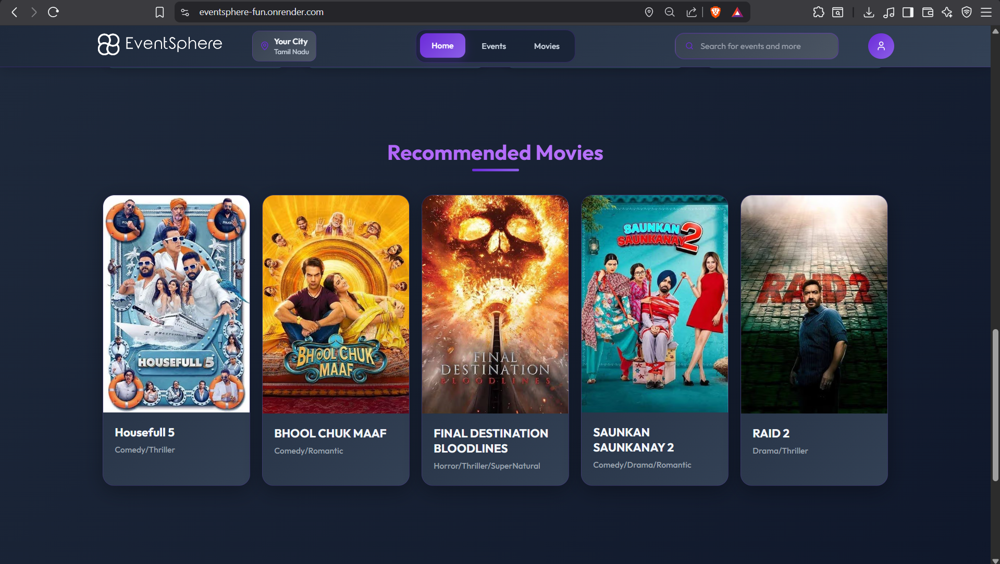
  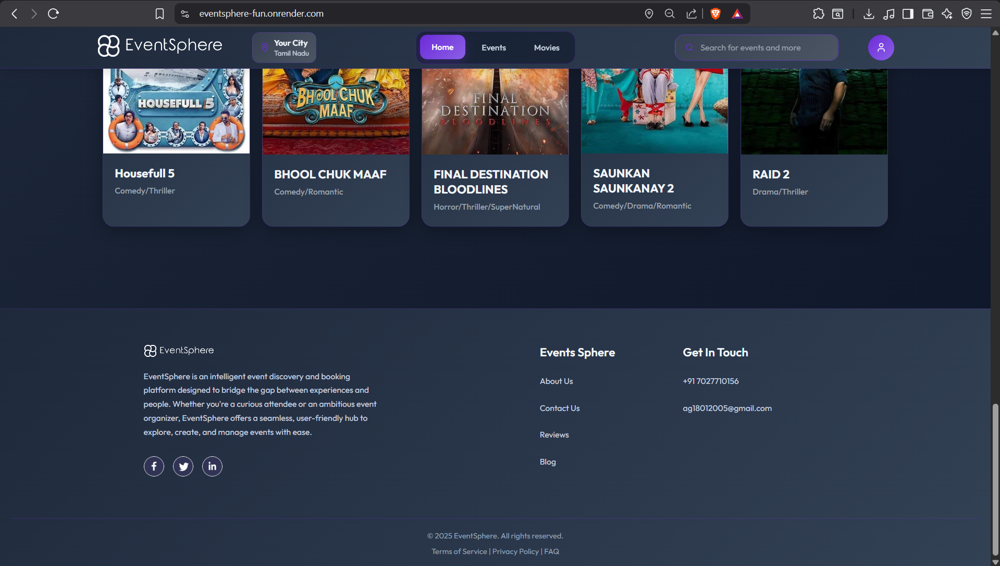
</p>

<p align="center">
  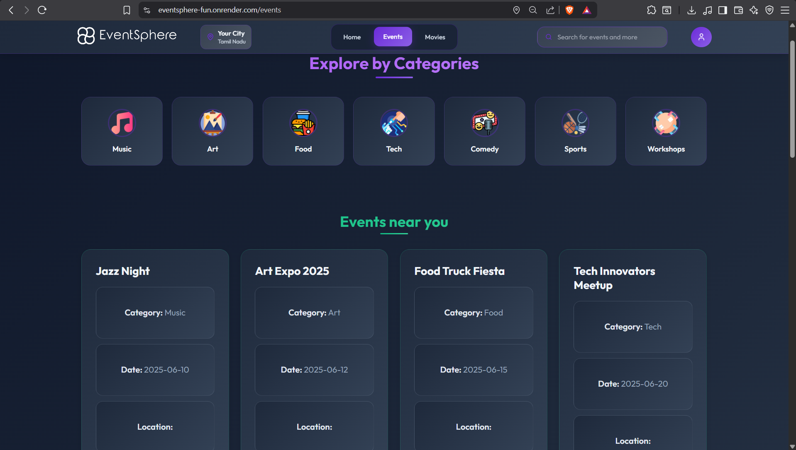
  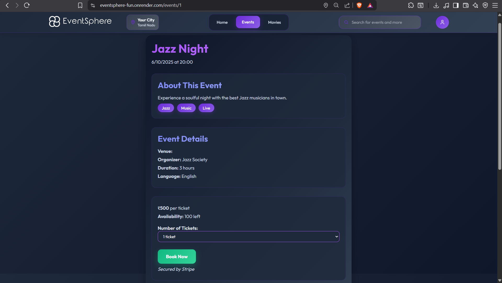
</p>

<p align="center">
  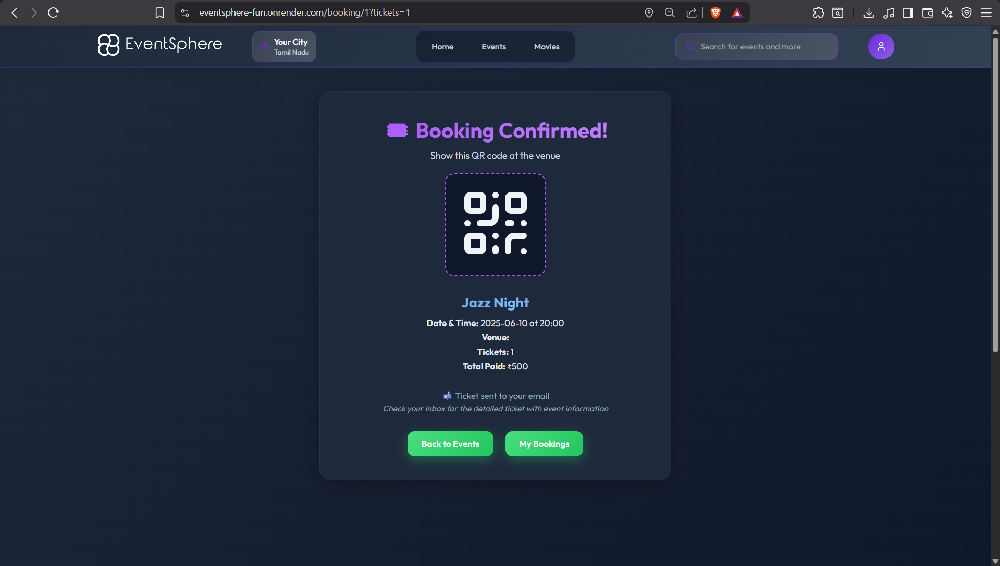
  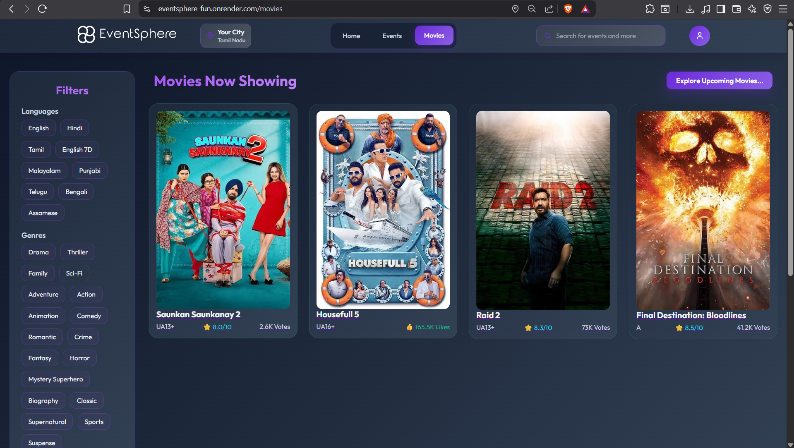
</p>

<p align="center">
  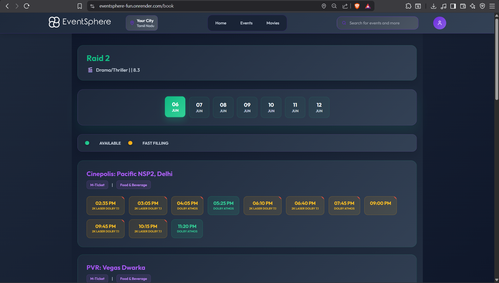
  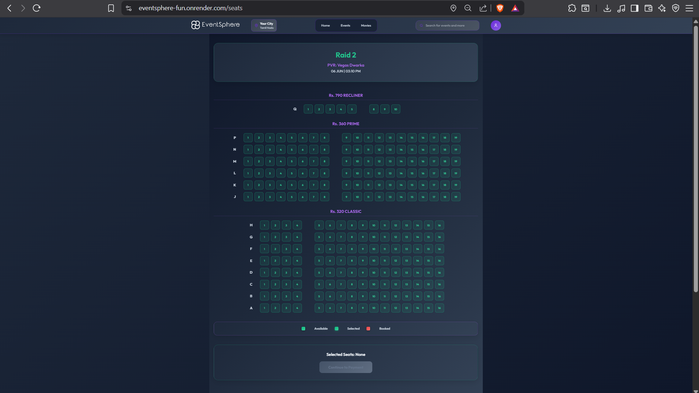
</p>

<p align="center">
  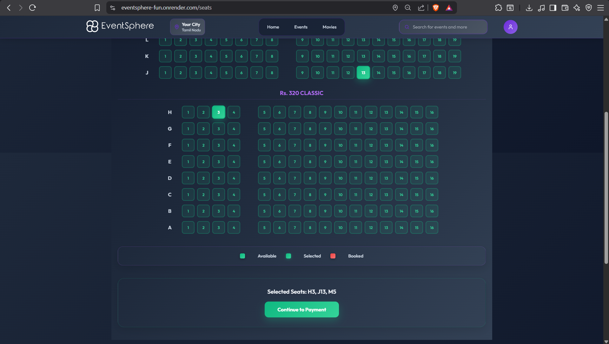
  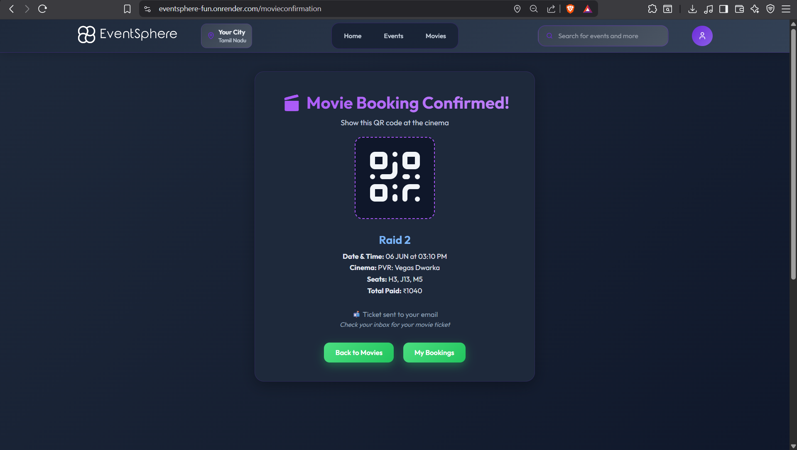
</p>

<p align="center">
  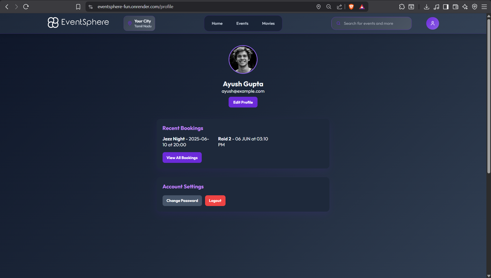
  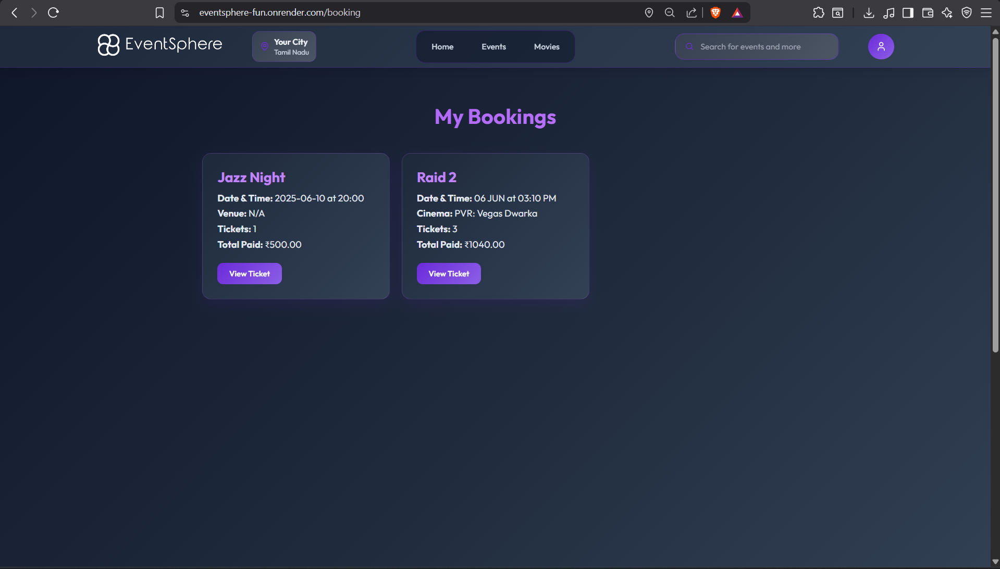
</p>

## 📝 Assumptions

Since this is a **frontend-only** project:

* All event and movie data is static, mock, or local JSON.
* No backend, authentication, or real-time verification exists.
* Ticket booking & seat selection are done purely on UI level.
* Checkout is a static confirmation screen.
* The structure is ready for backend integration later.

---

## ⭐ Future Enhancements

Possible extensions:

* Backend APIs for events & movies
* User authentication & profiles
* Online ticket payment
* Admin dashboard for adding events & movies
* Real-time seat locking
* Personalized recommendations
* Email/SMS ticket confirmation
